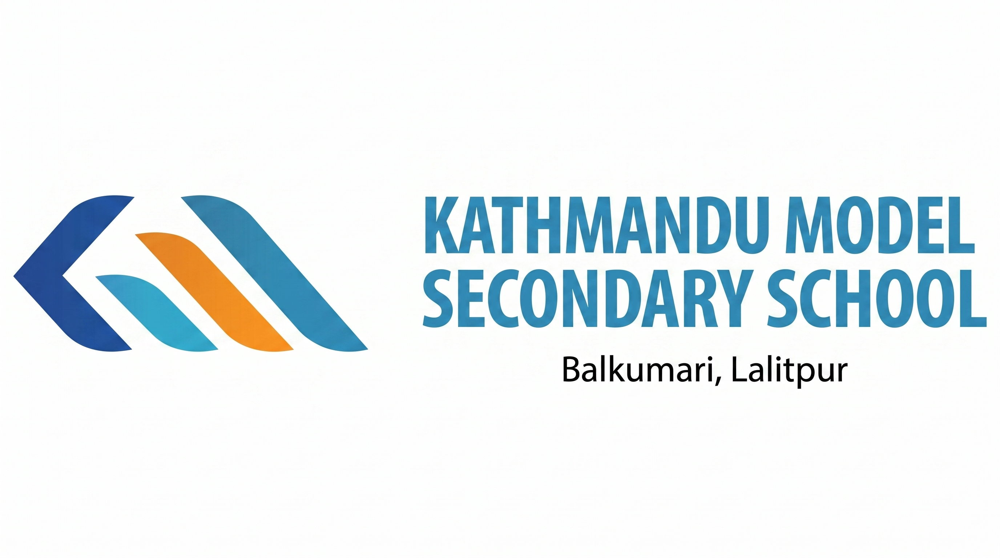

<div align="center">



<h1>Kathmandu Model Secondary School</h1>
<p><strong>Official Website — KMC Lalitpur</strong></p>

<p>
  <a href="https://kmclalitpur.edu.np" target="_blank">
    
  </a>
  &nbsp;
  
  &nbsp;
  
  &nbsp;
  
</p>

<p>
  
</p>

</div>

---

## About

This is the official website of **Kathmandu Model Secondary School (KMC Lalitpur)** — a NEB-affiliated +2 institution located in Balkumari, Lalitpur, Nepal. Established in 2000, KMC offers Science, Management, and Law (BA.LLB) streams with a consistent 97% NEB pass rate and over 2,500 students.

The website serves as the primary digital presence for the school — covering admissions, academics, news, events, faculty, gallery, alumni, and a fully-featured content management system for staff.

---

## Pages & Features

### Public-Facing
| Page | Description |
|---|---|
| **Home** | Hero, key stats, academic streams, facilities overview, latest news, alumni highlights |
| **Academics** | Detailed Science, Management, and BA.LLB (Law) stream information |
| **Admissions** | Eligibility criteria, step-by-step process, scholarship types, enquiry form |
| **About** | School history, mission & vision, principal's message, core values |
| **News & Notices** | Live news feed and official notices, updated from the admin panel |
| **Blog** | Long-form articles on education, careers, NEB preparation, college selection |
| **Gallery** | Categorised photo gallery served via Cloudinary CDN |
| **Alumni** | Success stories and KMC Alumni Association section |
| **Facilities** | Labs, library, hostel, transport, sports complex, cafeteria, auditorium |
| **FAQ** | Structured Q&A optimised for Google rich results and AI answer engines |
| **Contact** | Contact form with direct email delivery |

### AI Chatbot
An embedded Gemini-powered chatbot answers student queries about admissions, programs, fees, scholarships, and campus life — available on every page.

### Admin Panel (`/admin`)
A secure, role-protected content management system for school staff:

| Module | Capabilities |
|---|---|
| **News** | Create, edit, publish / unpublish articles |
| **Blog** | Full post editor with image upload and slug management |
| **Gallery** | Upload with crop tool, custom categories |
| **Notices** | Pin and manage official notices |
| **Faculty** | Add / edit faculty profiles with photos |
| **Alumni** | Manage alumni success stories |
| **Enquiries** | View and track admission enquiries |
| **Popups** | Create site-wide announcements with image, text, action buttons, and frequency control |
| **Settings** | Site-level configuration |

---

## Tech Stack

| Layer | Technology |
|---|---|
| Framework | [Next.js 16](https://nextjs.org) — App Router, React Server Components |
| Language | TypeScript 5 |
| Styling | Tailwind CSS v4 |
| Database | [Neon](https://neon.tech) — Serverless PostgreSQL |
| ORM | [Prisma 7](https://prisma.io) with PgBouncer connection pooling |
| Auth | [NextAuth v5](https://authjs.dev) — JWT sessions, credentials provider |
| Images | [Cloudinary](https://cloudinary.com) — upload, crop, CDN delivery |
| AI | [Google Gemini API](https://aistudio.google.com) — chatbot |
| Email | [Nodemailer](https://nodemailer.com) — contact form delivery |
| Analytics | [Vercel Analytics](https://vercel.com/analytics) |
| Deployment | [Vercel](https://vercel.com) |

---

## SEO, AEO & GEO

The site is fully optimised for search engines, AI answer engines, and generative AI tools:

- **Schema.org JSON-LD** — `EducationalOrganization`, `CollegeOrUniversity`, `LocalBusiness`, `FAQPage`, `Course`, `Person`, `BreadcrumbList`, `Article`, `WebPage`
- **Dynamic sitemap** — `/sitemap.xml` auto-includes all published blog posts from the DB
- **robots.txt** — explicitly allows Google, Bing, and AI crawlers (GPTBot, ClaudeBot, PerplexityBot, Applebot)
- **Open Graph & Twitter cards** — on every page for rich social previews
- **Canonical URLs**, `hreflang`, per-page metadata throughout
- **FAQPage schema** — makes FAQ answers eligible for Google rich results and AI citations
- **ISO 9001:2015** and NEB affiliation signals embedded in structured data

---

## Project Structure

```
├── app/
│   ├── page.tsx                  # Homepage
│   ├── layout.tsx                # Root layout — metadata, schema, fonts
│   ├── about/
│   ├── academics/
│   ├── admissions/
│   ├── alumni/
│   ├── blog/
│   ├── campus/
│   ├── contact/
│   ├── facilities/
│   ├── faq/
│   ├── gallery/
│   ├── news/
│   ├── admin/
│   │   ├── login/
│   │   └── (protected)/          # Auth-guarded admin routes
│   │       ├── alumni/
│   │       ├── blog/
│   │       ├── enquiries/
│   │       ├── faculty/
│   │       ├── gallery/
│   │       ├── news/
│   │       ├── notices/
│   │       ├── popups/
│   │       └── settings/
│   ├── api/
│   │   ├── admin/                # Protected CRUD API routes
│   │   ├── chatbot/              # Gemini AI chatbot endpoint
│   │   ├── contact/              # Email delivery endpoint
│   │   └── popups/               # Public active popup endpoint
│   ├── components/               # Shared UI components
│   ├── config/
│   │   └── site.ts               # Single source of truth for all site constants
│   └── lib/
│       └── prisma.ts             # Prisma singleton client
├── prisma/
│   ├── schema.prisma             # Database schema
│   ├── migrations/               # Migration history
│   └── seed.ts                   # Seeds the initial admin user
├── public/                       # Static assets
├── middleware.ts                 # Edge auth guard for /admin routes
└── next.config.ts                # Image optimisation, CSP headers, redirects
```

---

## Local Development

### Prerequisites

- Node.js ≥ 20
- A [Neon](https://neon.tech) PostgreSQL project
- A [Cloudinary](https://cloudinary.com) account
- A [Google Gemini](https://aistudio.google.com) API key

### Setup

```bash
# 1. Clone
git clone https://github.com/kasamthapa/kmc-lalitpur.git
cd kmc-lalitpur

# 2. Install dependencies
npm install

# 3. Configure environment
cp .env.example .env
# Fill in all values in .env

# 4. Initialise the database
npm run db:push     # Push schema to Neon
npm run db:seed     # Create the admin account

# 5. Start the dev server
npm run dev
```

Open [http://localhost:3000](http://localhost:3000) — admin panel at [http://localhost:3000/admin](http://localhost:3000/admin).

### Available Scripts

```bash
npm run dev           # Start development server (Turbopack)
npm run build         # Production build
npm run start         # Start production server
npm run lint          # ESLint

npm run db:generate   # Regenerate Prisma client after schema changes
npm run db:push       # Push schema to DB without a migration file
npm run db:migrate    # Create a named migration + push
npm run db:studio     # Open Prisma Studio (visual DB browser)
npm run db:seed       # Seed the admin user
```

---

## Environment Variables

Copy `.env.example` to `.env` and fill in each value. All variables are required unless marked optional.

| Variable | Description |
|---|---|
| `DATABASE_URL` | Neon **pooled** connection string (PgBouncer) — used at runtime |
| `DIRECT_URL` | Neon **direct** connection string — used for migrations only |
| `ADMIN_EMAIL` | Email address for the initial admin account |
| `ADMIN_PASSWORD` | Password for the initial admin account |
| `NEXTAUTH_SECRET` | Random secret for JWT signing — generate with `openssl rand -base64 32` |
| `NEXTAUTH_URL` | Full URL of the deployed site (e.g. `https://kmclalitpur.edu.np`) |
| `NEXT_PUBLIC_CLOUDINARY_CLOUD_NAME` | Your Cloudinary cloud name |
| `NEXT_PUBLIC_CLOUDINARY_UPLOAD_PRESET` | Cloudinary unsigned upload preset name |
| `GEMINI_API_KEY` | Google Gemini API key — chatbot will be disabled without this |

---

## Deployment

The project is deployed on **Vercel** with automatic deployments on push to `main`.

1. Add all environment variables in **Vercel → Project → Settings → Environment Variables**
2. Set `NEXTAUTH_URL` to your production domain
3. Push to `main` — Vercel handles the rest

> The Prisma connection pool is capped at `max: 3` to stay within Neon's free-tier connection limit.

---

## License

This project is proprietary software built for **Kathmandu Model Secondary School, Lalitpur**. All rights reserved.
